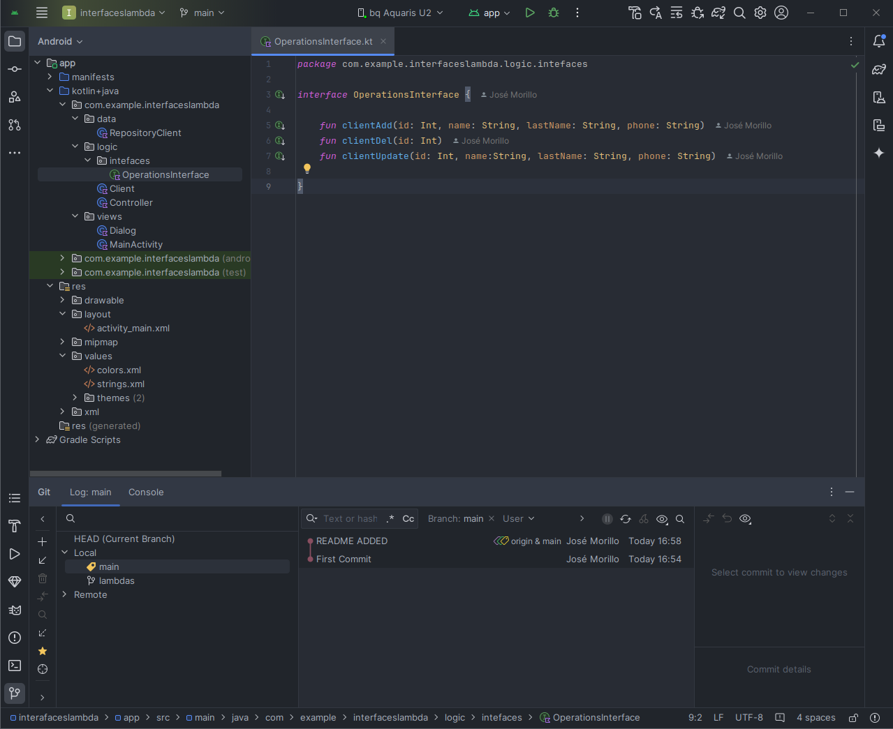
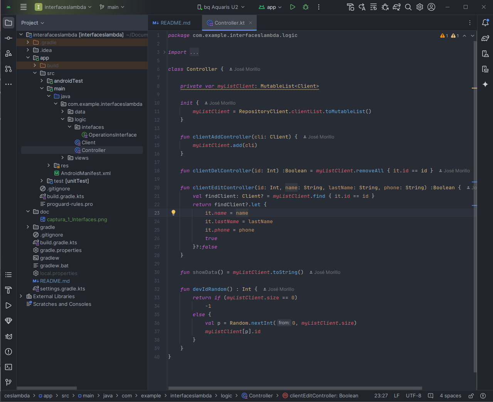
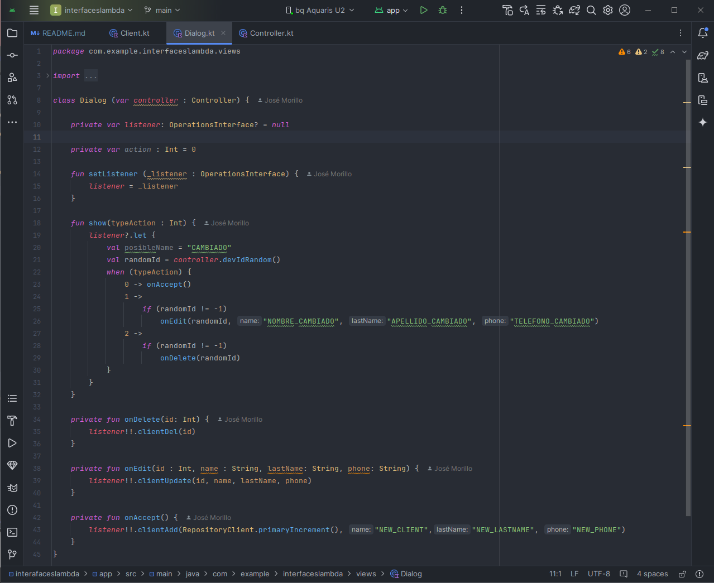
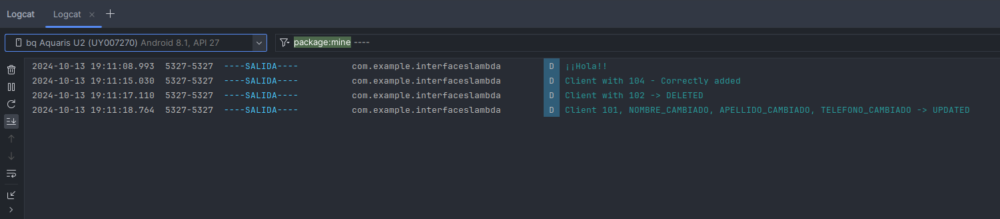

# Proyecto Android - Interfaces - Lambdas

## RAMA MAIN - INTERFAZ
 

Métodos implementados en la interfaz OperationsInterface

 

Clase Controller que maneja la lógica de negocio con los métodos CRUD

 

Clase Dialog que simula la interacción con el usuario con un listener que recoge las interacciones.
 

LogCat con trazas al hacer click en los iconos de la App
 

 
 
 
Código del metodo start() en el MainActivity:
 
        
    `private fun start() {

        myButtonAdd = findViewById(R.id.imageView_myButtonAdd)
        myButtonDel = findViewById(R.id.imageView_myButtonDel)
        myButtonUpdate = findViewById(R.id.imageView_myButtonEdit)

        myDialog = Dialog(controller)
        myDialog.setListener(this)

        myButtonAdd.setOnClickListener {
            //
            myDialog.show(0)
        }

        myButtonDel.setOnClickListener {
            myDialog.show(2)
        }

        myButtonUpdate.setOnClickListener {
            myDialog.show(1)
        }
    }`

 
 
Métodos sobreescritos en el MainActivity que llaman al Controlador.
 

    `override fun clientAdd(id: Int, name: String, lastName: String, phone: String) {
        val newClient = Client(id, name, lastName, phone)
        controller.clientAddController(newClient)
        val msg = "Client with $id - Correctly added"

        Log.d(TAG, msg)

    }`

    `override fun clientDel(id: Int) {
        val delete = controller.clientDelController(id)
        if(delete)
            Log.d(TAG, "Client with $id -> DELETED")
        else
            Log.d(TAG, "Client with id $id NOT FOUND $id par")
    }`

    `override fun clientUpdate(id: Int, name: String, lastName: String, phone: String) {
        val update = controller.clientEditController(id, name, lastName, phone)
        if(update)
            Log.d(TAG, "Client $id, $name, $lastName, $phone -> UPDATED")
        else
            Log.d(TAG, "CANNOT UPDATE THIS CLIENT")
    }`
